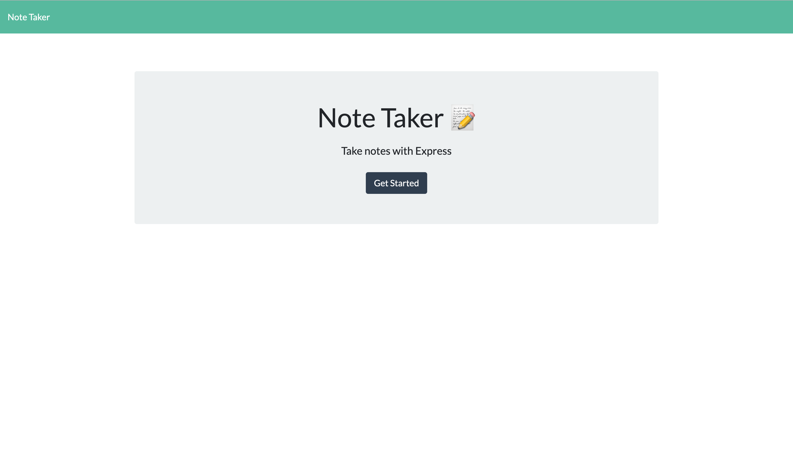

# Note-Taker

## Table of contents
* [Deployed Repo](#deployed-repo)
* [Assignment Info](#assignment-info)
* [Technologies](#technologies)
* [Running Pages](#running-pages)
* [Key Notes](#key-notes)

## Deployed Repo
* HTML
 https://note-taker-owen.herokuapp.com/

## Assignment info
Working with routes for the assignment. With a given public
folder, I had to route bewtween several files. Mainly reading
my database or json file. An array of objects that is getting 
updated throught the html and script files. Using express to use
the get method to read between the htmls, the the get, post
and delete methods to update the database and html. Users are  
able to create notes and delete them as well.
	
## Technologies
Project is created with:
* Bootstrap v4.4
* Visual Studios Code (HTML/CSS/JS/JQ)
* Google/W3
* Node.js
* Express
* NPM
	
## Running Pages
* Here are some screen shots of the running page from an images folder:

 

 

## Key Notes
* Bootstrap link for html format

```
$ <link rel="stylesheet" href="https://stackpath.bootstrapcdn.com/bootstrap/4.3.1/css/bootstrap.min.css"
        integrity="sha384-ggOyR0iXCbMQv3Xipma34MD+dH/1fQ784/j6cY/iJTQUOhcWr7x9JvoRxT2MZw1T" crossorigin="anonymous">
```

*  NPM
- install
- require
- inquirer
- path
- nodemon
- test